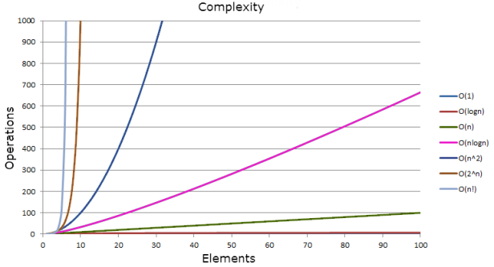

## Big O Notation

Measuring how your code scales. For science!

---

### Outline

- What does it mean to "scale"?
- Why do we care?
- Terminology
- At Worst
- Arrays vs. Linked Lists
- Sorting Examples

---

### What Does It Mean To "Scale"?

In CS, we're talking about how our efficiency changes as we "scale up".

It's not just **_how much more time_** an operation takes, but how quickly that time **_increases_**.

---

### Let's Say You Have To Keep An Alphabetical List

If we add 100,000 names to our list, and we need to re-alphabetize: do we need to do:

- 100,000 more operations? (One per item.)
- Or 10,000,000,000? (100,000 **_squared_**.)
- Or we're scaling insanely efficiently, and it's **_the square root_**; 100,000 more things means re-alphabetizing only takes 300 more operations!

---

### Some Terminology

The relatively simple mathematical notation we use to describe scale is called "Big O Notation".

- The capital `O` is where we get the term.
- In the parens, we usually talk about `n`, which is the length of the dataset.
- Anything we do to `n` describes how things scale.

Examples include `O(n)`, `O(n^2)`, `O(log n)`.

---

### Let's Look Again At Our Alphabetizing Example

If we add 100,000 more names to our list:

- 100,000 more operations would be `O(n)`.
- 10,000,000,000 more operations would be `O(n^2)`
- 300 more operations would be `O(log n)`

---

### Let's Visualize It!



The more items we add to the dataset (horizontal)...

... the more operation we have to do (vertical)

---

### Array Time Complexity

No matter how many elements you have in an array, adding one to the end takes **_1_** operation

That's `O(1)`!

Same for accessing an element. Whether it's `arr[5]` or `arr[329741]`, it's a quick lookup.

---

### But Adding To Or Removing From The Start...

...means everything has to be shoved over by one.

That's `O(n)`. We have to go through the whole array!

```javascript
["an", "inefficient", "operation"].unshift("what");
// ---> ["what", "an", "inefficient", "operation"]
// Everything got shoved over by one index!
```

---

### But With A Doubly Linked List

Adding and removing from either end is an `O(1)` operation.

While accessing an item now takes `O(n)` time.

You might have to traverse through the whole linked list to find your item!

---

### We Have Trade-Offs

If you're accessing elements in the middle a lot, an array is more efficient.

But if you're adding and removing from both sides (say, a queue!), you want a Linked List.

---

### Accessing
